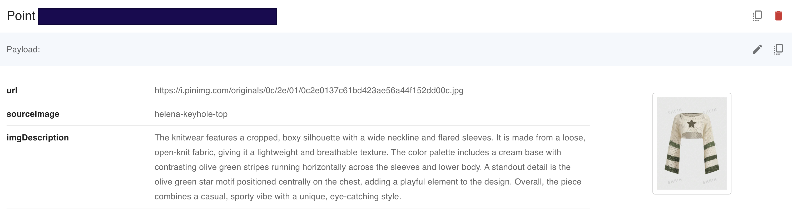

# Pinterest-Scraper

*An image interpreter built on top of a Pinterest Webscraper. Images from pinterest as described via Open AI's API and written to Qdrant vector database. The Qdrant database will then be queried to look for similar images based on a description*

# Installation
* **1 Download requirements**
```shell
git clone https://github.com/sarasoh1/PinterestImageDescriber
cd PinterestImageDescriber
npm install
```

# Demo
Image from pinterest written into Qdrant database with corresponding description



# Console to Run Directly with ts-node;
```shell
npm run start
```

## Credits
Special thanks to Bes-js for the pinterest webscraper!
https://github.com/Bes-js/Pinterest-Scraper
